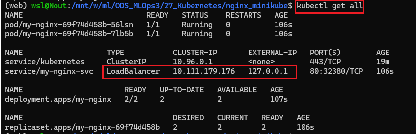

**How to run?**

1. Run a config [nginx.yaml](nginx.yaml) file:
`kubectl apply -f nginx.yaml`
 
2. Start the tunnel to the LoadBalancer:
`minikube tunnel`
 
3. Get info about the deployment:
`kubectl get all`

 
4. Check deployment with the browser:

1

2

3

4

5

