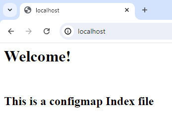

**How to run?**

1. Run a config [nginx.yaml](nginx.yaml) file:
`kubectl apply -f nginx.yaml`

2. Start the tunnel to the LoadBalancer:
`minikube tunnel`

3. Get info about the deployment:
`kubectl get all`

4. Check deployment with the browser:

